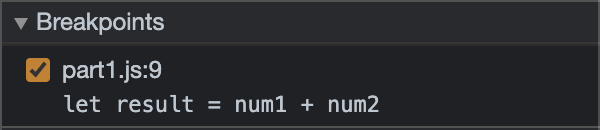
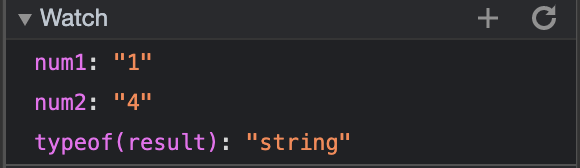
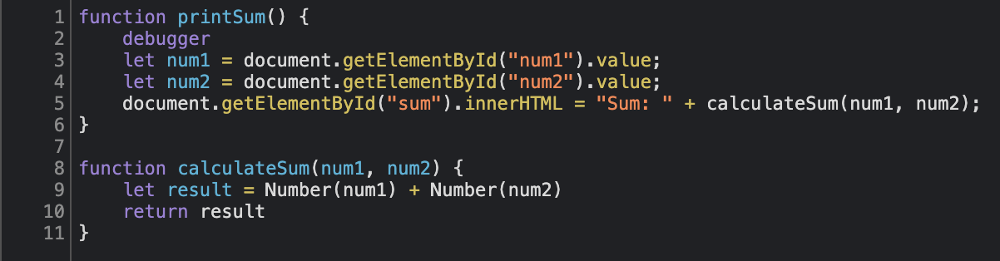

# Part 3

## Part 1

1. It does string concatenation of the string representation of the numbers input from First number and Second number instead of adding those numbers.  
   Screenshots taken as part of the debugging process:  
   
     

2. This can be fixed by explicitly converting the operands, num1 and num2, to number data types to facilitate arithmetic addition instead of string concatenation. This is done in part1.js.  
   Screenshot of the fix:  
   

## Part 2

3. citylots.json
4. part2.js
5. 11.7 MB
6. 4.92 s
7. Mozilla/5.0 (Macintosh; Intel Mac OS X 10_14_6) AppleWebKit/537.36 (KHTML, like Gecko) Chrome/90.0.4430.85 Safari/537.36
8. Apache
9. Tue, 26 Jan 2021 22:14:13 GMT
10. application/json
11. fetchData()
